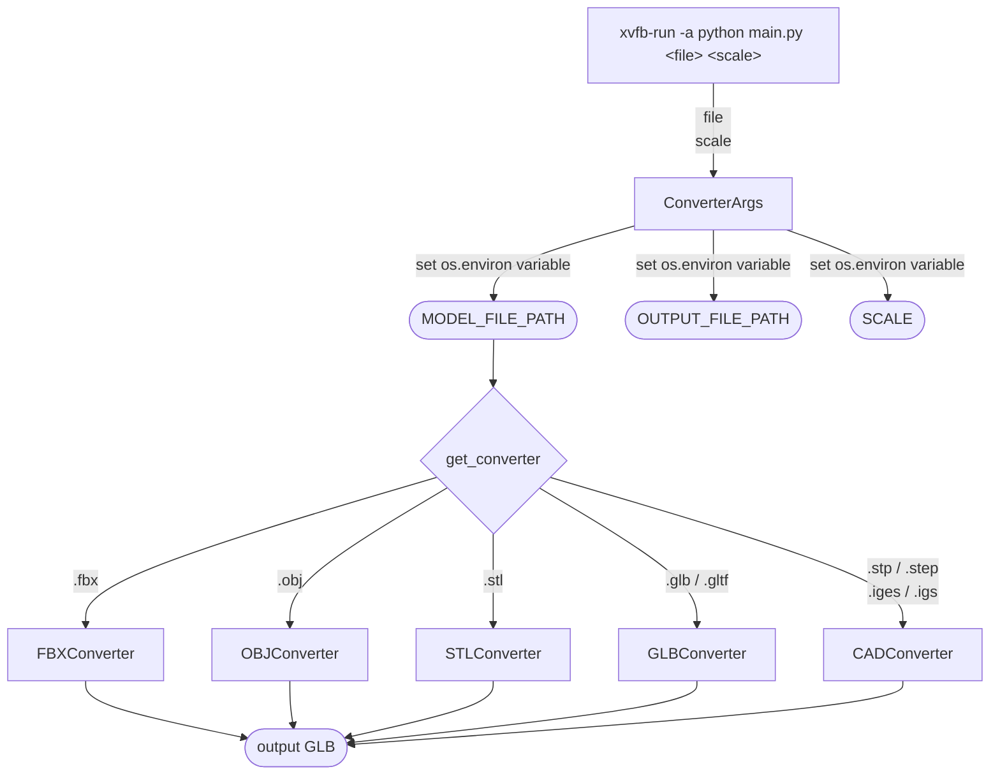
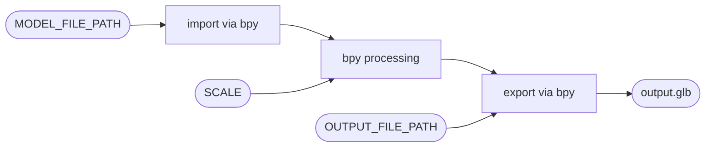
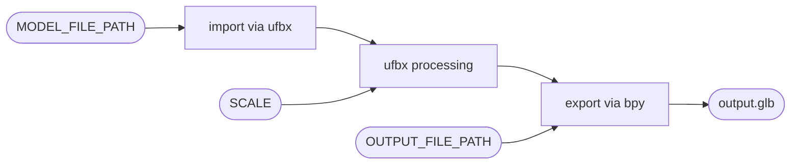
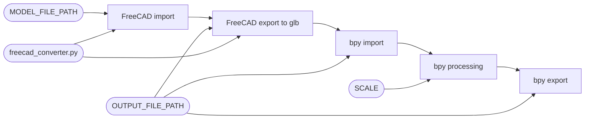
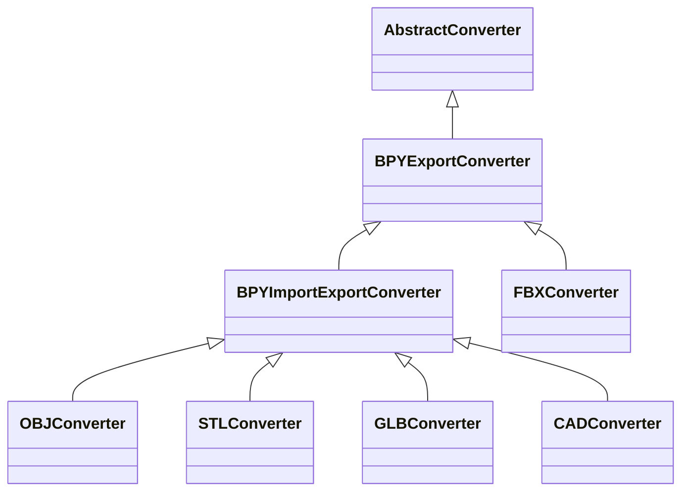

# Architecture

The module is run inside the container using the following command:

```cmd
xvfb-run -a python main.py <file> <scale>
```

`<file>` is the path of the input model file. The path can be given as a relative path or absolute path.


`<scale>` is the scale that the model is designed in. Modeling softwares may define their default unit scales differently. For example, Blender defines `1 unit = 1 m` where Maya defines `1 unit = 1 cm`. All our export methods use Blender's (bpy) export method, so a model designed in Maya will be exported as it was `100` times bigger with no scaling information given beforehand. The `<scale>` value must be either one of: `"mm"`, `"cm"`, `"m"` or `"in"`.  


The command line arguments `<file>` and `<scale>` are converted to `os.environ` variables. There is also an `OUTPUT_FILE_PATH` environment variable which is defined as `output.glb` in the source code.  


The converter to be used is decided by the method `get_converter`, using the extention of `MODEL_FILE_PATH`.

## Data flow



### OBJ / STL / GLB / GLTF

For these models, a straight forward `bpy` import-process-export pipeline is utilized. The specific details in the processing stage differ from format to format. 

For OBJ format, `OBJConverter`; for STL format, `STLConverter`; for GLB/GLTF formats, `GLBConverter` is used. 




### FBX

For FBX model files, `FBXConverter` is used. `ufbx` Python library is used to load the model to memory. Then, `bpy` materials and meshes are created from the `ufbx` data. Finally, the model is exported to GLB using `bpy`.

`ufbx` is the importer of choice instead of `bpy`. This is because the FBX importer in `bpy 5.0.0` is in experimental stage. Some of the problems of **that** exporter were:

* Doesn't handle proprietary material render engines like `Corona` and `V-Ray`. The exporter defaults to a white material when it encounters these.
* Some meshes had face orientation issues which messed up lighting and display of the model.



### CAD (STEP / IGES)

For CAD-based models like STEP (STP) and IGES (IGS), `CADConverter` is used. The converter first starts the FreeCAD software, inserts the `freecad_converter.py` macro inside its terminal and executes the macro to get the converted GLB. After obtaining the GLB, the converter works like `GLBConverter` where the GLB is fed into a `bpy` import-export pipeline and DRACO compression is applied.



---

## Class hierarchy

Below diagram shows the class relations of converters in the module.



---